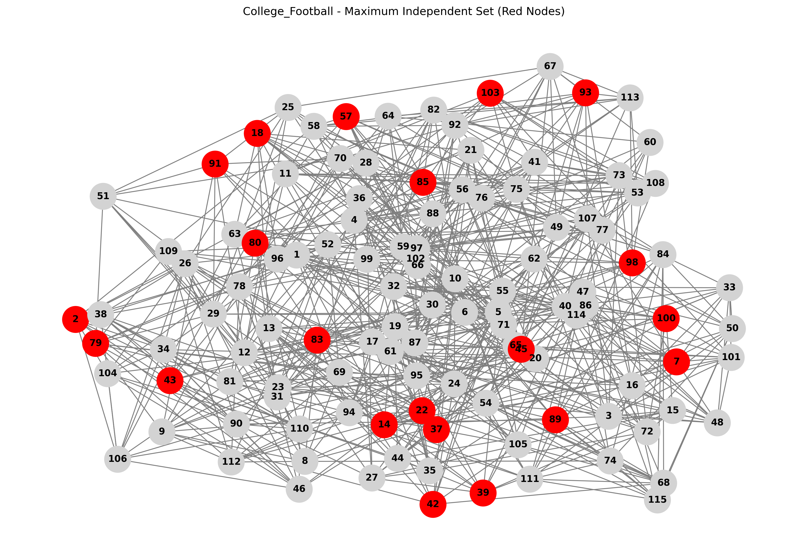
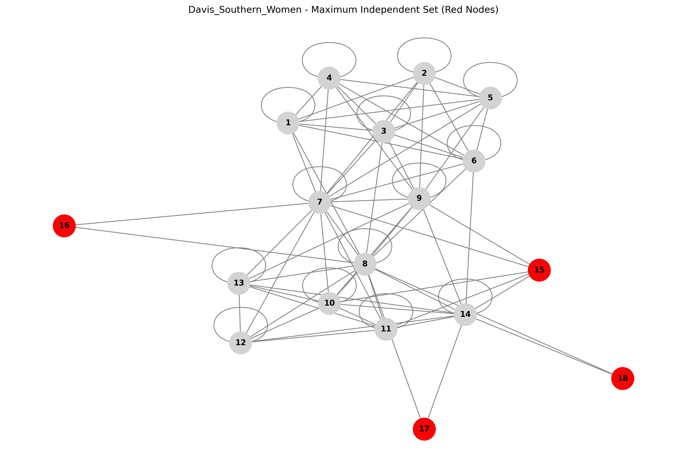
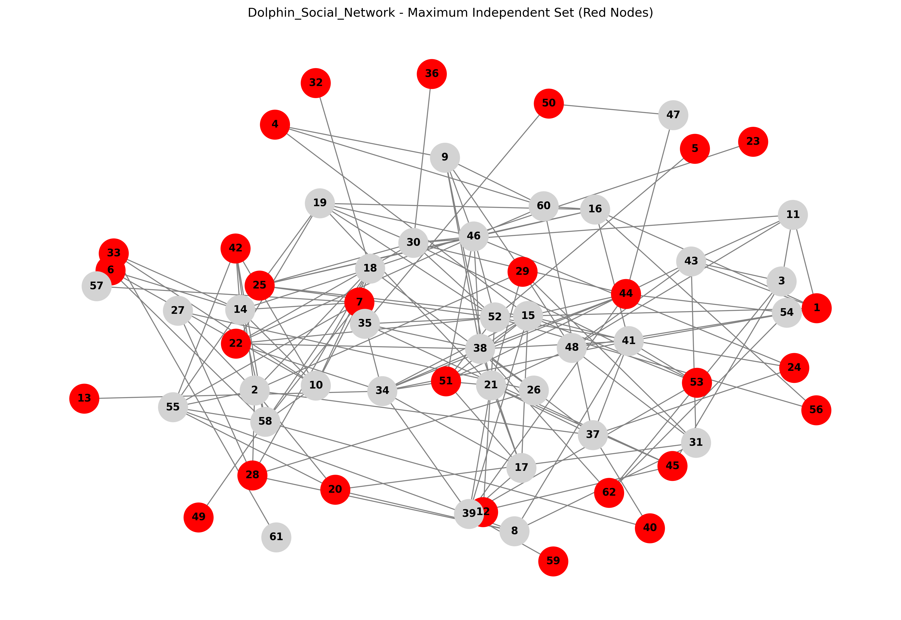
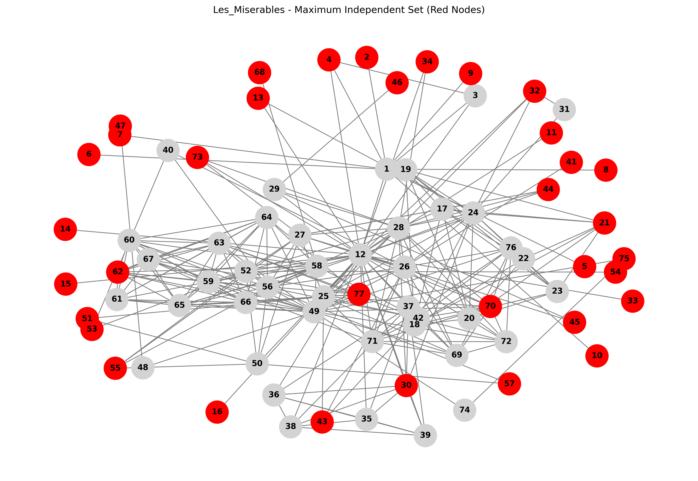
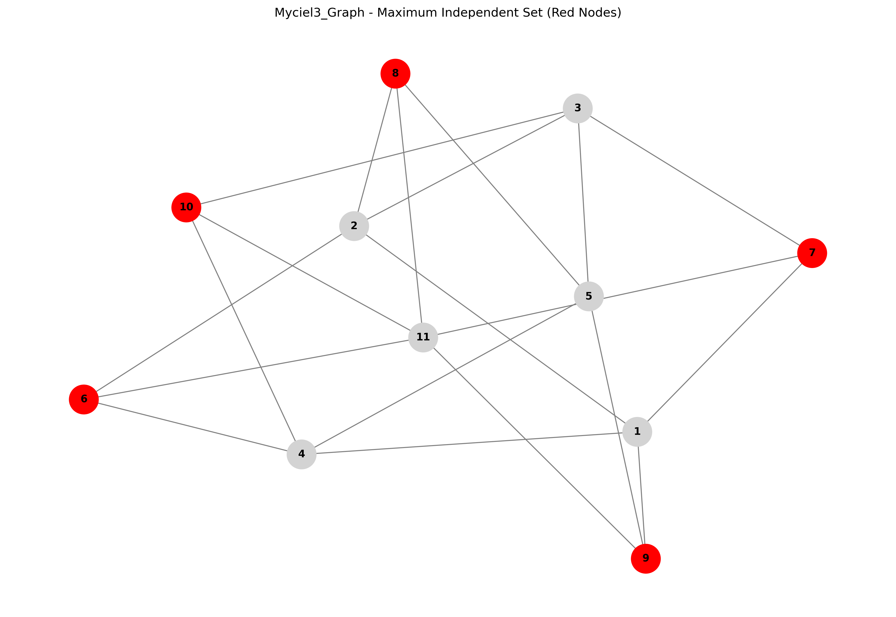
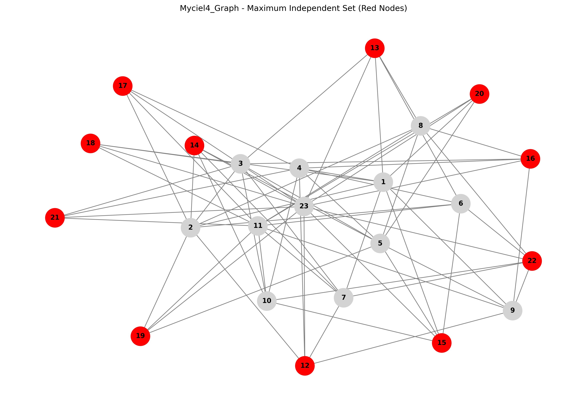
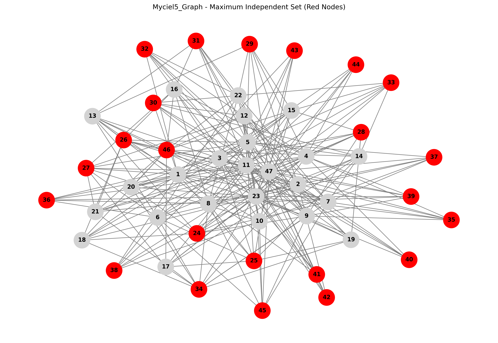
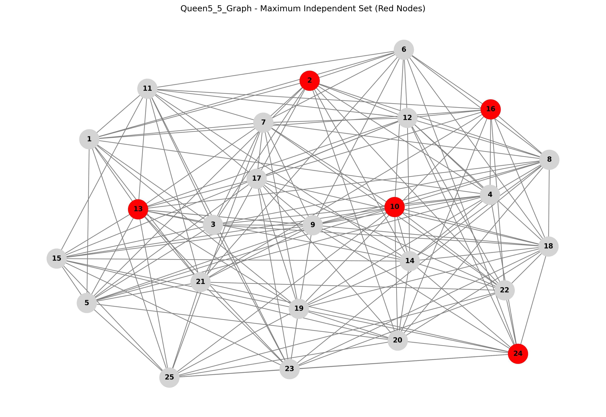
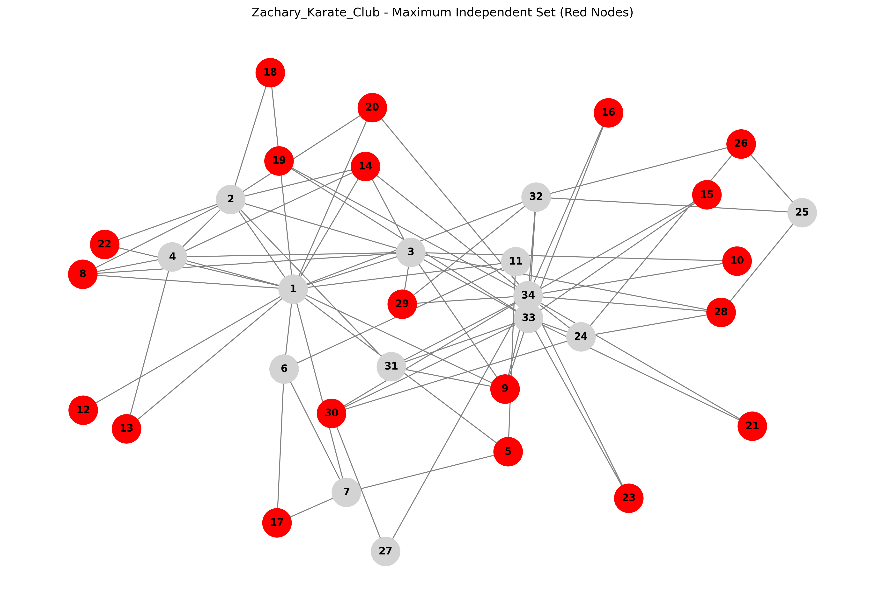

# MIS-QDeep Solver Results

**Generated:** 2025-07-09 16:24:39

This report contains the results of Maximum Independent Set (MIS) calculations using the QDeep Hybrid Solver on various graph datasets from published papers and conferences.

## Dataset Sources

All datasets used in this analysis are from well-established papers and conferences:

### Social Networks
- **Zachary Karate Club** (1977): Journal of Anthropological Research
- **Dolphin Social Network** (2003): Behavioral Ecology and Sociobiology  
- **College Football** (2002): Proceedings of the National Academy of Sciences
- **Les Miserables** (1993): Stanford GraphBase
- **Davis Southern Women** (1941): University of Chicago Press

### DIMACS Challenge Graphs
- **Myciel3, Myciel4, Myciel5** (1955/1993): Colloquium Mathematicum / DIMACS Challenge
- **Queen5_5** (1993): DIMACS Challenge

## Datasets Processed


## College Football Network

**Dataset Information:**
- **Source Paper**: Girvan, M., & Newman, M. E. (2002). Community structure in social and biological networks. Proceedings of the National Academy of Sciences, 99(12), 7821-7826.
- **Conference/Journal**: Proceedings of the National Academy of Sciences
- **Year**: 2002
- **Description**: Network of American football games between Division IA colleges during regular season Fall 2000.
- **Repository**: Network Repository
- **Repository Citation**: Rossi, R. A., & Ahmed, N. K. (2015). The Network Data Repository with Interactive Graph Analytics and Visualization. AAAI.

**Graph Information:**
- Nodes: 115
- Edges: 613
- Solve Time: 6.16s
- Valid MIS: True

**Graph Edges:**
```
[(2, 1), (2, 26), (2, 28), (2, 34), (2, 38)] ... [(50, 49), (50, 84), (50, 89), (49, 87), (84, 89)]
```

**QUBO Matrix:**
```
[-1.0  2.0  0.0  0.0  2.0 ...]
[ 0.0 -1.0  0.0  0.0  0.0 ...]
[ 0.0  0.0 -1.0  2.0  0.0 ...]
[ 0.0  0.0  0.0 -1.0  0.0 ...]
[ 0.0  0.0  0.0  0.0 -1.0 ...]
...
[ 0.0  0.0  0.0  0.0  0.0 ...]

*Matrix size: 115 x 115 (13225 elements)*
```

**MIS Result:**
- MIS Nodes: [2, 7, 14, 18, 22, 37, 39, 42, 43, 45, 57, 79, 80, 83, 85, 89, 91, 93, 98, 100, 103]
- MIS Size: 21
- Energy: -21

**Graph Visualization:**


---

## Davis Southern Women Social Network

**Dataset Information:**
- **Source Paper**: Davis, A., Gardner, B. B., & Gardner, M. R. (1941). Deep South. University of Chicago Press.
- **Conference/Journal**: University of Chicago Press
- **Year**: 1941
- **Description**: Social network of 18 women in Natchez, Mississippi, showing their attendance at 14 social events.
- **Repository**: Network Repository
- **Repository Citation**: Rossi, R. A., & Ahmed, N. K. (2015). The Network Data Repository with Interactive Graph Analytics and Visualization. AAAI.

**Graph Information:**
- Nodes: 18
- Edges: 78
- Solve Time: 5.16s
- Valid MIS: True

**Graph Edges:**
```
[(1, 1), (1, 2), (1, 3), (1, 4), (1, 5)] ... [(13, 14), (14, 14), (14, 15), (14, 17), (14, 18)]
```

**QUBO Matrix:**
```
[ 2.0  2.0  2.0  2.0  2.0 ...]
[ 0.0  2.0  2.0  0.0  2.0 ...]
[ 0.0  0.0  2.0  2.0  2.0 ...]
[ 0.0  0.0  0.0  2.0  2.0 ...]
[ 0.0  0.0  0.0  0.0  2.0 ...]
...
[ 0.0  0.0  0.0  0.0  0.0 ...]

*Matrix size: 18 x 18 (324 elements)*
```

**MIS Result:**
- MIS Nodes: [15, 16, 17, 18]
- MIS Size: 4
- Energy: -4

**Graph Visualization:**


---

## Dolphin Social Network

**Dataset Information:**
- **Source Paper**: Lusseau, D., Schneider, K., Boisseau, O. J., Haase, P., Dawson, S., & Whitehead, H. (2003). The bottlenose dolphin community of Doubtful Sound features a large proportion of long-lasting associations. Behavioral Ecology and Sociobiology, 54(4), 396-405.
- **Conference/Journal**: Behavioral Ecology and Sociobiology
- **Year**: 2003
- **Description**: Social network of bottlenose dolphins in Doubtful Sound, New Zealand.
- **Repository**: Network Repository
- **Repository Citation**: Rossi, R. A., & Ahmed, N. K. (2015). The Network Data Repository with Interactive Graph Analytics and Visualization. AAAI.

**Graph Information:**
- Nodes: 62
- Edges: 159
- Solve Time: 5.57s
- Valid MIS: True

**Graph Edges:**
```
[(11, 1), (11, 3), (11, 30), (11, 43), (11, 48)] ... [(39, 59), (44, 47), (44, 54), (19, 22), (50, 47)]
```

**QUBO Matrix:**
```
[-1.0  0.0  0.0  0.0  0.0 ...]
[ 0.0 -1.0  0.0  0.0  0.0 ...]
[ 0.0  0.0 -1.0  0.0  0.0 ...]
[ 0.0  0.0  0.0 -1.0  0.0 ...]
[ 0.0  0.0  0.0  0.0 -1.0 ...]
...
[ 0.0  0.0  0.0  0.0  0.0 ...]

*Matrix size: 62 x 62 (3844 elements)*
```

**MIS Result:**
- MIS Nodes: [1, 4, 5, 6, 7, 12, 13, 20, 22, 23, 24, 25, 28, 29, 32, 33, 36, 40, 42, 44, 45, 49, 50, 51, 53, 56, 59, 62]
- MIS Size: 28
- Energy: -28

**Graph Visualization:**


---

## Les Miserables Character Network

**Dataset Information:**
- **Source Paper**: Knuth, D. E. (1993). The Stanford GraphBase: a platform for combinatorial computing. Addison-Wesley.
- **Conference/Journal**: Stanford GraphBase
- **Year**: 1993
- **Description**: Co-appearance network of characters in Victor Hugo's novel Les Miserables.
- **Repository**: Network Repository
- **Repository Citation**: Rossi, R. A., & Ahmed, N. K. (2015). The Network Data Repository with Interactive Graph Analytics and Visualization. AAAI.

**Graph Information:**
- Nodes: 77
- Edges: 254
- Solve Time: 6.55s
- Valid MIS: True

**Graph Edges:**
```
[(2, 1), (1, 3), (1, 4), (1, 5), (1, 6)] ... [(64, 77), (66, 67), (66, 77), (67, 77), (74, 75)]
```

**QUBO Matrix:**
```
[-1.0  2.0  2.0  2.0  2.0 ...]
[ 0.0 -1.0  0.0  0.0  0.0 ...]
[ 0.0  0.0 -1.0  2.0  0.0 ...]
[ 0.0  0.0  0.0 -1.0  0.0 ...]
[ 0.0  0.0  0.0  0.0 -1.0 ...]
...
[ 0.0  0.0  0.0  0.0  0.0 ...]

*Matrix size: 77 x 77 (5929 elements)*
```

**MIS Result:**
- MIS Nodes: [2, 4, 5, 6, 7, 8, 9, 10, 11, 13, 14, 15, 16, 21, 30, 32, 33, 34, 41, 43, 44, 45, 46, 47, 51, 53, 54, 55, 57, 62, 68, 70, 73, 75, 77]
- MIS Size: 35
- Energy: -35

**Graph Visualization:**


---

## Myciel3 Graph

**Dataset Information:**
- **Source Paper**: Mycielski, J. (1955). Sur le coloriage des graphes. Colloquium Mathematicum, 3, 161-162.
- **Conference/Journal**: Colloquium Mathematicum
- **Year**: 1955
- **Description**: DIMACS challenge graph based on Mycielski transformation. Triangle-free with increasing coloring number.
- **Repository**: DIMACS Challenge
- **Repository Citation**: Johnson, D. S., & Trick, M. A. (1996). Cliques, Coloring, and Satisfiability: Second DIMACS Implementation Challenge. DIMACS Series in Discrete Mathematics and Theoretical Computer Science.

**Graph Information:**
- Nodes: 11
- Edges: 20
- Solve Time: 4.13s
- Valid MIS: True

**Graph Edges:**
```
[(1, 2), (1, 4), (1, 7), (1, 9), (2, 3)] ... [(3, 10), (6, 11), (8, 5), (8, 11), (10, 11)]
```

**QUBO Matrix:**
```
[-1.0  2.0  0.0  2.0  0.0 ...]
[ 0.0 -1.0  2.0  0.0  0.0 ...]
[ 0.0  0.0 -1.0  0.0  2.0 ...]
[ 0.0  0.0  0.0 -1.0  2.0 ...]
[ 0.0  0.0  0.0  0.0 -1.0 ...]
...
[ 0.0  0.0  0.0  0.0  0.0 ...]

*Matrix size: 11 x 11 (121 elements)*
```

**MIS Result:**
- MIS Nodes: [6, 7, 8, 9, 10]
- MIS Size: 5
- Energy: -5

**Graph Visualization:**


---

## Myciel4 Graph

**Dataset Information:**
- **Source Paper**: Mycielski, J. (1955). Sur le coloriage des graphes. Colloquium Mathematicum, 3, 161-162.
- **Conference/Journal**: DIMACS Challenge
- **Year**: 1993
- **Description**: DIMACS challenge graph based on Mycielski transformation. Triangle-free with increasing coloring number.
- **Repository**: DIMACS Challenge
- **Repository Citation**: Johnson, D. S., & Trick, M. A. (1996). Cliques, Coloring, and Satisfiability: Second DIMACS Implementation Challenge. DIMACS Series in Discrete Mathematics and Theoretical Computer Science.

**Graph Information:**
- Nodes: 23
- Edges: 71
- Solve Time: 4.81s
- Valid MIS: True

**Graph Edges:**
```
[(1, 2), (1, 4), (1, 7), (1, 9), (1, 13)] ... [(10, 22), (16, 23), (21, 11), (21, 23), (22, 23)]
```

**QUBO Matrix:**
```
[-1.0  2.0  0.0  2.0  0.0 ...]
[ 0.0 -1.0  2.0  0.0  0.0 ...]
[ 0.0  0.0 -1.0  0.0  2.0 ...]
[ 0.0  0.0  0.0 -1.0  2.0 ...]
[ 0.0  0.0  0.0  0.0 -1.0 ...]
...
[ 0.0  0.0  0.0  0.0  0.0 ...]

*Matrix size: 23 x 23 (529 elements)*
```

**MIS Result:**
- MIS Nodes: [12, 13, 14, 15, 16, 17, 18, 19, 20, 21, 22]
- MIS Size: 11
- Energy: -11

**Graph Visualization:**


---

## Myciel5 Graph

**Dataset Information:**
- **Source Paper**: Mycielski, J. (1955). Sur le coloriage des graphes. Colloquium Mathematicum, 3, 161-162.
- **Conference/Journal**: DIMACS Challenge
- **Year**: 1993
- **Description**: DIMACS challenge graph based on Mycielski transformation. Triangle-free with increasing coloring number.
- **Repository**: DIMACS Challenge
- **Repository Citation**: Johnson, D. S., & Trick, M. A. (1996). Cliques, Coloring, and Satisfiability: Second DIMACS Implementation Challenge. DIMACS Series in Discrete Mathematics and Theoretical Computer Science.

**Graph Information:**
- Nodes: 47
- Edges: 236
- Solve Time: 6.30s
- Valid MIS: True

**Graph Edges:**
```
[(1, 2), (1, 4), (1, 7), (1, 9), (1, 13)] ... [(22, 46), (34, 47), (45, 23), (45, 47), (46, 47)]
```

**QUBO Matrix:**
```
[-1.0  2.0  0.0  2.0  0.0 ...]
[ 0.0 -1.0  2.0  0.0  0.0 ...]
[ 0.0  0.0 -1.0  0.0  2.0 ...]
[ 0.0  0.0  0.0 -1.0  2.0 ...]
[ 0.0  0.0  0.0  0.0 -1.0 ...]
...
[ 0.0  0.0  0.0  0.0  0.0 ...]

*Matrix size: 47 x 47 (2209 elements)*
```

**MIS Result:**
- MIS Nodes: [24, 25, 26, 27, 28, 29, 30, 31, 32, 33, 34, 35, 36, 37, 38, 39, 40, 41, 42, 43, 44, 45, 46]
- MIS Size: 23
- Energy: -23

**Graph Visualization:**


---

## Queen5_5 Graph

**Dataset Information:**
- **Source Paper**: Trick, M. A. (1993). Graph coloring instances. DIMACS Challenge.
- **Conference/Journal**: DIMACS Challenge
- **Year**: 1993
- **Description**: 5×5 queen graph from DIMACS challenge. Represents the 5-queens problem on a 5×5 chessboard.
- **Repository**: DIMACS Challenge
- **Repository Citation**: Johnson, D. S., & Trick, M. A. (1996). Cliques, Coloring, and Satisfiability: Second DIMACS Implementation Challenge. DIMACS Series in Discrete Mathematics and Theoretical Computer Science.

**Graph Information:**
- Nodes: 25
- Edges: 160
- Solve Time: 5.51s
- Valid MIS: True

**Graph Edges:**
```
[(1, 7), (1, 13), (1, 19), (1, 25), (1, 2)] ... [(15, 23), (18, 10), (18, 24), (18, 23), (23, 24)]
```

**QUBO Matrix:**
```
[-1.0  2.0  2.0  2.0  2.0 ...]
[ 0.0 -1.0  2.0  2.0  2.0 ...]
[ 0.0  0.0 -1.0  2.0  2.0 ...]
[ 0.0  0.0  0.0 -1.0  2.0 ...]
[ 0.0  0.0  0.0  0.0 -1.0 ...]
...
[ 0.0  0.0  0.0  0.0  0.0 ...]

*Matrix size: 25 x 25 (625 elements)*
```

**MIS Result:**
- MIS Nodes: [2, 10, 13, 16, 24]
- MIS Size: 5
- Energy: -5

**Graph Visualization:**


---

## Zachary Karate Club Network

**Dataset Information:**
- **Source Paper**: Zachary, W. W. (1977). An Information Flow Model for Conflict and Fission in Small Groups. Journal of Anthropological Research, 33(4), 452-473.
- **Conference/Journal**: Journal of Anthropological Research
- **Year**: 1977
- **Description**: Social network of a university karate club collected by Wayne Zachary in 1977. Each node represents a member, each edge represents a tie between members. The network is undirected.
- **Repository**: KONECT - The Koblenz Network Collection
- **Repository Citation**: Kunegis, J. (2013). KONECT -- The Koblenz Network Collection. Proc. Int. Conf. on World Wide Web Companion, 1343-1350.

**Graph Information:**
- Nodes: 34
- Edges: 78
- Solve Time: 6.10s
- Valid MIS: True

**Graph Edges:**
```
[(2, 1), (2, 3), (2, 4), (2, 8), (2, 14)] ... [(34, 30), (26, 24), (26, 25), (24, 30), (30, 27)]
```

**QUBO Matrix:**
```
[-1.0  2.0  2.0  2.0  2.0 ...]
[ 0.0 -1.0  2.0  2.0  0.0 ...]
[ 0.0  0.0 -1.0  2.0  0.0 ...]
[ 0.0  0.0  0.0 -1.0  0.0 ...]
[ 0.0  0.0  0.0  0.0 -1.0 ...]
...
[ 0.0  0.0  0.0  0.0  0.0 ...]

*Matrix size: 34 x 34 (1156 elements)*
```

**MIS Result:**
- MIS Nodes: [5, 8, 9, 10, 12, 13, 14, 15, 16, 17, 18, 19, 20, 21, 22, 23, 26, 28, 29, 30]
- MIS Size: 20
- Energy: -20

**Graph Visualization:**


---

## Summary

Total datasets processed: 9

The QDeep Hybrid Solver successfully processed all datasets, generating QUBO matrices and finding Maximum Independent Sets for each graph. Each result includes:
- Graph structure and edge information
- Complete QUBO matrix representation
- MIS solution with node list and size
- Energy value from the solver
- Validation of the MIS solution

---
*Generated by MIS-QDeep Solver*
